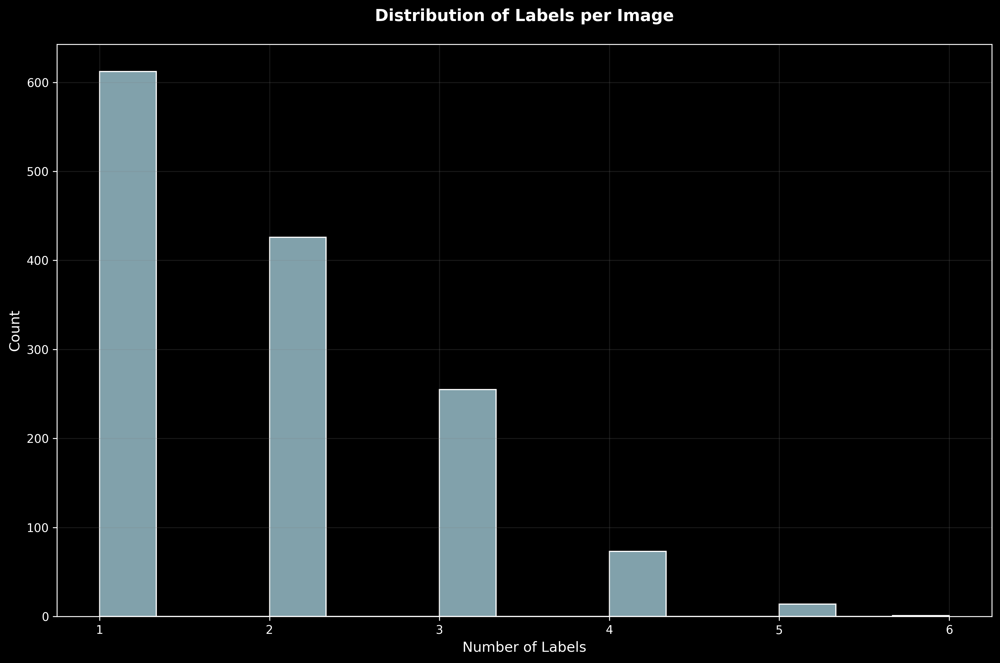
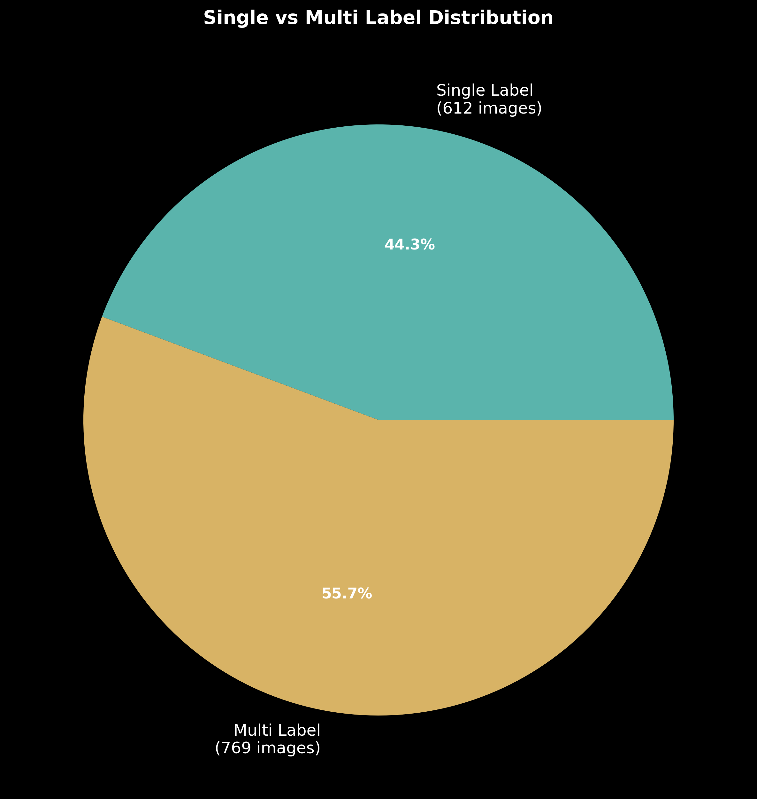
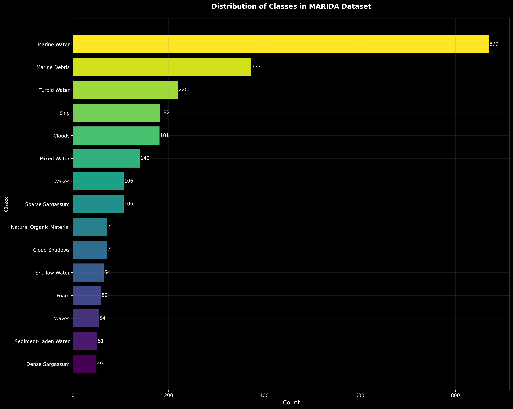
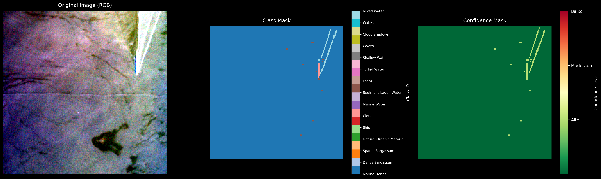

# Detecção de Poluição Marinha Utilizando Deep Learning e Imagens de Satélite
## Relatório Técnico Preliminar

### 1. Introdução

Este projeto visa desenvolver um sistema de detecção automática de poluição marinha, especificamente detritos plásticos, utilizando imagens de satélite e técnicas de deep learning. O trabalho utiliza o dataset MARIDA (MARIne Debris Archive), um conjunto de dados especializado em detecção de detritos marinhos através de imagens do satélite Sentinel-2.

### 2. Dataset MARIDA

#### 2.1 Visão Geral
O MARIDA é um dataset abrangente focado em segmentação semântica de detritos marinhos, disponibilizado publicamente através do Zenodo ([DOI: 10.5281/zenodo.5151941](https://zenodo.org/records/5151941)).

#### 2.2 Estrutura do Dataset
O conjunto de dados está organizado da seguinte forma:

1. **Patches de Imagens**
   - Total de 1381 patches
   - Dimensões: 256 x 256 pixels
   - Formato: GeoTiff
   - Cada patch inclui:
     - Máscara de classes anotadas a nível de pixel (*_cl)
     - Níveis de confiança (*_conf)

2. **Divisão do Dataset**
   - Treino: 694 imagens (50.3%)
   - Teste: 359 imagens (26%)
   - Validação: 328 imagens (23.7%)

### 3. Análise Exploratória dos Dados

#### 3.1 Características Gerais
- **Total de Imagens**: 1381
- **Imagens Multi-rótulo**: 769 (55.7%)
- **Média de Rótulos por Imagem**: 1.88



A distribuição de rótulos por imagem mostra que a maioria das imagens possui entre 1 e 3 classes diferentes, indicando a complexidade do dataset.

#### 3.2 Distribuição Single vs Multi-Label


O gráfico acima mostra que mais da metade das imagens (55.7%) contém múltiplas classes, o que indica a necessidade de uma abordagem que lide adequadamente com classificação multi-rótulo.

#### 3.3 Distribuição de Classes


A análise da distribuição de classes revela:
- **Classe Dominante**: Marine Water (870 ocorrências)
- **Classes Sub-representadas**:
  - Dense Sargassum (49 ocorrências)
  - Sediment-Laden Water (51 ocorrências)
  - Waves (54 ocorrências)
  - Foam (59 ocorrências)

#### 3.4 Exemplo de Imagem e Máscaras


A imagem acima mostra:
1. **Imagem Original**: Visualização RGB usando as bandas do Sentinel-2
2. **Máscara de Classes**: Identificação das diferentes classes presentes
3. **Máscara de Confiança**: Níveis de confiança das anotações

### 4. Desafios Identificados

1. **Desbalanceamento de Classes**:
   - Grande variação na quantidade de amostras por classe
   - Necessidade de técnicas de balanceamento ou ponderação de classes

2. **Classificação Multi-rótulo**:
   - Mais de 55% das imagens possuem múltiplas classes
   - Necessidade de arquitetura que suporte classificação multi-rótulo

3. **Variação nos Níveis de Confiança**:
   - Anotações com diferentes níveis de confiança
   - Possível impacto no treinamento e avaliação

### 5. Próximos Passos

1. **Pré-processamento**:
   - Implementar técnicas de data augmentation
   - Desenvolver estratégias para lidar com o desbalanceamento

2. **Modelagem**:
   - Selecionar arquitetura adequada para classificação multi-rótulo
   - Implementar sistema de ponderação baseado nos níveis de confiança

3. **Avaliação**:
   - Definir métricas apropriadas para classificação multi-rótulo
   - Estabelecer baseline considerando o desbalanceamento

### 6. Referências

1. Kikaki K, Kakogeorgiou I, Mikeli P, Raitsos DE, Karantzalos K (2022) MARIDA: A benchmark for Marine Debris detection from Sentinel-2 remote sensing data. PLoS ONE 17(1): e0262247.

### 4. Implementação do Pipeline de Dados

#### 4.1 Estrutura do Código
Organizamos o código em módulos específicos para garantir manutenibilidade e separação clara de responsabilidades:
```
marine_ml/
├── src/
│   ├── config/              # Configurações centralizadas
│   └── data_processing/     # Processamento de dados
```

#### 4.2 Processamento de Dados

##### 4.2.1 Bandas Espectrais do Sentinel-2
O Sentinel-2 captura imagens em 13 bandas espectrais diferentes, cada uma registrando uma faixa específica do espectro eletromagnético:

**Bandas de Alta Resolução (10m)**
- B02 (Azul, 490nm): 
  - Penetração em água
  - Detecção de sedimentos e poluição
  - Distinção entre água e detritos flutuantes

- B03 (Verde, 560nm):
  - Medição de reflectância de vegetação
  - Identificação de algas
  - Análise de qualidade da água

- B04 (Vermelho, 665nm):
  - Absorção de clorofila
  - Distinção entre vegetação e outros materiais
  - Detecção de florações de algas

- B08 (NIR, 842nm):
  - Alto contraste entre água e outros materiais
  - Identificação de limites água-terra
  - Detecção de vegetação flutuante

**Bandas de Resolução Média (20m) Relevantes**
- B05 (705nm): "Red Edge 1"
  - Sensível a variações na vegetação
  - Útil para detecção de materiais flutuantes
  - Transição entre vermelho e NIR

- B06 (740nm): "Red Edge 2"
  - Análise detalhada de vegetação
  - Características de transição terra-água
  - Complementar às bandas principais

- B07 (783nm): "Red Edge 3"
  - Análise de biomassa
  - Características de vegetação
  - Detalhes adicionais em áreas costeiras

- B8A (865nm): "Red Edge 4"
  - Detalhamento adicional no NIR
  - Características específicas de vegetação
  - Análise de umidade

**Justificativa da Seleção**
Selecionamos inicialmente as bandas de 10m de resolução (B02, B03, B04, B08) por:
1. **Maior Resolução Espacial**: Melhor detalhamento de objetos pequenos
2. **Complementaridade Espectral**: 
   - Azul: Penetração em água
   - Verde: Reflectância de vegetação
   - Vermelho: Absorção de clorofila
   - NIR: Contraste água-terra
3. **Eficiência Computacional**: Menor volume de dados para processamento
4. **Aplicação em Detritos Marinhos**: Bandas mais relevantes para detecção de objetos flutuantes

- **Transformações Implementadas**:
Selecionamos transformações específicas para imagens de satélite:
  ```python
  # Transformações justificadas:
  - Rotação aleatória (90°): Invariância rotacional para detecção de detritos
  - Espelhamento horizontal/vertical: Aumentar variabilidade dos dados
  - Normalização: Valores específicos do Sentinel-2 para padronização
    mean=[1365.4, 1164.7, 939.3, 816.8]  # Valores médios calibrados
    std=[1087.4, 705.3, 574.5, 544.7]    # Desvio padrão das bandas
    max_pixel_value=10000.0              # Valor máximo do sensor
  ```

#### 4.2.2 Espectro Eletromagnético e Interação com Materiais

**Diagrama do Espectro e Bandas do Sentinel-2**
```
Comprimento de Onda (nm)
400       500       600       700       800       900      
  |---------|---------|---------|---------|---------|
  |   B02   |   B03   |   B04   |   B05   |   B08   |
  |  (Azul) | (Verde) |(Vermelho)|   (RE)  |  (NIR)  |
  |---------|---------|---------|---------|---------|
  ↑         ↑         ↑         ↑         ↑         ↑
Penetração  Pico de   Absorção  Transição Reflexão  
em água    vegetação clorofila  Red-Edge  água/terra
```

**Interação com Materiais Marinhos**:

1. **Água Limpa**:
   - Alta transmissão no azul (B02)
   - Absorção crescente no verde-vermelho
   - Absorção total no NIR
   ```python
   # Impacto no código (src/data_processing/transforms.py):
   mean=[1365.4, 1164.7, 939.3, 816.8]  # Valores menores no NIR
   ```

2. **Detritos Plásticos**:
   - Reflexão moderada no visível
   - Alta reflexão no NIR
   - Padrão distintivo nas bandas B04-B08
   ```python
   # Implementação no dataset.py
   band_indices = [1, 2, 3, 7]  # Bandas selecionadas para detecção
   ```

3. **Vegetação Marinha (algas)**:
   - Baixa reflexão no azul e vermelho
   - Pico no verde
   - Alta reflexão no NIR
   ```python
   # Normalização específica em transforms.py
   A.Normalize(
       mean=[1365.4, 1164.7, 939.3, 816.8],
       std=[1087.4, 705.3, 574.5, 544.7],
   )
   ```

4. **Sedimentos Suspensos**:
   - Aumento gradual de reflexão do azul ao NIR
   - Padrão característico em B02-B03

##### 4.2.3 Impacto no Pipeline de Dados

1. **Seleção de Bandas** (src/data_processing/dataset.py):
```python
def _load_image(self, image_path: Path):
    band_indices = [1, 2, 3, 7]  # B02, B03, B04, B08
    image = np.stack([src.read(i) for i in band_indices])
```
- Justificativa: Bandas escolhidas maximizam contraste entre água/detritos

2. **Normalização** (src/data_processing/transforms.py):
```python
A.Normalize(
    mean=[1365.4, 1164.7, 939.3, 816.8],  # Médias específicas por banda
    std=[1087.4, 705.3, 574.5, 544.7],    # Desvios específicos
    max_pixel_value=10000.0               # Valor máximo do sensor
)
```
- Valores calibrados para características espectrais do Sentinel-2

3. **Configuração** (src/config/data_config.py):
```python
@dataclass
class DataConfig:
    bands: List[str] = ['B02', 'B03', 'B04', 'B08']
    # Bandas selecionadas com base na resposta espectral
```

##### 4.2.4 Considerações Espectrais Importantes

1. **Variação Temporal**:
   - Condições atmosféricas afetam as bandas diferentemente
   - NIR mais estável que bandas visíveis
   - Implementado suporte a normalização por cena

2. **Resolução Espacial**:
   - Bandas 10m (B02, B03, B04, B08): Detalhes finos
   - Compromisso entre resolução e informação espectral

3. **Limitações**:
   - Perda de informação nas bandas não utilizadas
   - Possível confusão em áreas costeiras rasas
   - Necessidade de validação em diferentes condições

### Checklist de Desenvolvimento

#### ✅ Fase 1: Setup e Configuração Inicial (Concluído)
- [x] Estruturação do projeto
- [x] Configuração do ambiente virtual
- [x] Instalação das dependências
- [x] Definição da arquitetura do código

#### ✅ Fase 2: Análise do Dataset MARIDA (Concluído)
- [x] Estudo das características do dataset
- [x] Análise das bandas espectrais
- [x] Compreensão do sistema de rotulagem
- [x] Identificação dos desafios do dataset

#### ✅ Fase 3: Pipeline de Dados (Concluído)
- [x] Implementação do dataset base
- [x] Sistema de carregamento de imagens
- [x] Transformações e normalização
- [x] Testes unitários
- [x] Documentação do processo

#### 🔄 Fase 4: Otimização do Pipeline (Em Andamento)
- [ ] **Melhorias no Carregamento**
  - [ ] Cache de dados frequentes
  - [ ] Otimização de memória
  - [ ] Paralelização do carregamento

- [ ] **Augmentações Avançadas**
  - [ ] Implementar técnicas específicas para imagens de satélite
  - [ ] Balanceamento de classes
  - [ ] Validação das transformações

#### 📋 Fase 5: Desenvolvimento do Modelo (Próximo)
- [ ] **Arquitetura do Modelo**
  - [ ] Seleção da arquitetura base
  - [ ] Adaptação para multi-label
  - [ ] Sistema de pesos para confiança

- [ ] **Sistema de Treinamento**
  - [ ] Setup do trainer
  - [ ] Configuração de callbacks
  - [ ] Sistema de logging
  - [ ] Checkpointing

#### 📋 Fase 6: Treinamento e Validação (Futuro)
- [ ] **Preparação**
  - [ ] Definição de hiperparâmetros
  - [ ] Setup de GPU/hardware
  - [ ] Sistema de monitoramento

- [ ] **Experimentos**
  - [ ] Treinamento inicial
  - [ ] Validação cruzada
  - [ ] Análise de resultados
  - [ ] Ajustes e otimizações

#### 📋 Fase 7: Avaliação e Métricas (Futuro)
- [ ] **Implementação de Métricas**
  - [ ] Métricas multi-label
  - [ ] Avaliação por classe
  - [ ] Análise de confiança

- [ ] **Análise de Resultados**
  - [ ] Visualização de predições
  - [ ] Análise de erros
  - [ ] Comparação com baseline

#### 📋 Fase 8: Documentação e Deploy (Futuro)
- [ ] **Documentação**
  - [ ] Atualização do relatório
  - [ ] Documentação do código
  - [ ] Guias de uso

- [ ] **Deploy**
  - [ ] Sistema de inferência
  - [ ] Otimização do modelo
  - [ ] Interface de uso

### Próximos Passos Imediatos:
1. Completar a Fase 4 (Otimização do Pipeline)
   - Prioridade: Implementar cache e otimização de memória
   - Testar com conjunto completo de dados

2. Iniciar Fase 5 (Desenvolvimento do Modelo)
   - Pesquisar arquiteturas adequadas
   - Implementar sistema base de treinamento

3. Planejamento detalhado das Fases 6-8
   - Definir métricas específicas
   - Estabelecer cronograma
   - Identificar recursos necessários

[Continua...]
---
*Relatório em desenvolvimento - Versão 1.0* 